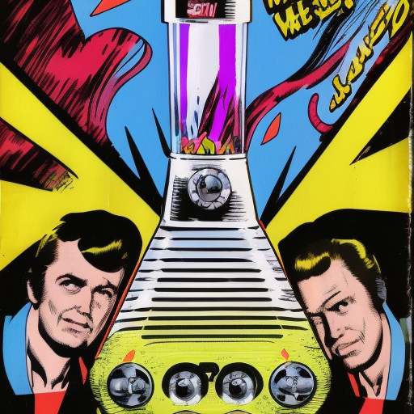

# Games Engines 1 Assignment 2022-2023 
## The Six Million Dollar Man's Lava Lamp

## The Brief 

Create an interactive hologram of a cool device from vintage sci-fi, such as Star Trek, the Six Million Dollar Man, Space 1999, 2001: A Space Odyssey, Knight Rider, Thunderbirds, Flash Gordon, Back to the Future etc. etc. Anything from 60's 70's and early 80's. 

Some ideas:

- The six million dollar mans lava lamp
- A self playing guitar or piano
- A volcano
- A fire place with futuristic effects
- A harry potter style book or picture that comes to life
- An alien in a jar
- AN R2D2 type robot
- An abstract audio responsive artwork
- An octopus in a tank
- A transporter
- A futuristic kitchen appliance
- A giant talking head
- A futuristic machine with lots of lights and moving parts

- This thing for holding the Medusan Ambassador from Star Trek:

- This cool thing from Joe 90:

- The teleporter from the movie "the Fly"

Watch any vintage (pre 1985) sci-fi show  or movie  you will get lots of ideas. The more nostalgic, cool and nerdy the better.

Check out this video of people going crazy (including myself) for the Knight Rider car :-):

- [Knight Rider](https://photos.app.goo.gl/gqpCMHJu5SNbWjj89)

You will manage your project in a github repo, making documented commits as you make progress and include a detailed readme.md in your git repo along with your project. Here is [a template](assignmentreadme.md) you can use for your readme. Also you can use this [gitignore file](.gitignore). Here is [a tutorial on using git](gitlab.md) if you need to brush up!

For Computer Science students this is an individual project. For Game Design students, you can work solo or on a team of up to three people. You can model your device using ProBuilder directly in Unity or use Blender. You should write scripts in C# to interact with the device. We have lots of VR headsets you guys can use to test your holograms on. 

# Due dates:
- Week 8 - Proposal & git repo - [Submit proposal here](https://forms.office.com/Pages/ResponsePage.aspx?id=yxdjdkjpX06M7Nq8ji_V2ou3qmFXqEdGlmiD1Myl3gNUQlhURzM4MzFWSTdDTDlERFdZTkw2UThQTS4u)
- Week 13 - Final submission & in-class, in-person demos
 
 # Weighting

| Category | Weighting |
|-|-|
| Groovyness | 30%  |
| Complexity | 30% |
| Project management & documentation | 30% |
| Proposal | 10% |

# Rubric

## Groovyness - Visuals & sound, Quality of outcome

| Grade | Indicative Aspects |
|-------|------------|
| 1     | Project is deployed to the Quest and has great framerate. It looks amazing with a high level of polish on the visuals. Great use of color and form. The object is fully usable in VR and AR. There is lots of functionality and interactivity - for example buttons to press, levers to turn, colors changing, movement, animation etc. Lots of novelty and nostalgia. Use of visual effects such as particle system, post-processing or custom shaders to enhance visual quality. Has a clear visual style. Has great sound effects. Is very cool indeed. Super cool in fact. Special gold star just like Joe 90. |
| 2.1 | Maybe deployed to the Quest but has some glitches or runs just on PC not in AR. Looks pretty good with decent but simple self made models made in ProBuilder or Blender. No visual effects. Maybe a particle system. Sound effects grabbed from online sources. Some simple interactivity and button presses. Less coherent visual style. Good novelty value. |
| 2.2 |  One or two simple models made in ProBuilder or imported from online sources. No interactivity, just an animated visual. Running in the Unity editor. Little or no sound |
| Pass | Model from online source or primitive that does not do anything |
| Fail | Does not compile or little or no content |
 
 ## Complexity - Coding, maths, algorithm and system design 

 | Grade | Indicative Aspects |
 |-------|------------|
 | 1 | 15-20 hours work. A complex system that has lots of interactivity. 5 or 6 MonoBehaviors that interact and work together to implement the functionality of the hologram. A complex algorithm such as a generative system used to generate the effect. Several hundred lines of self written C# code. Nice gizmos on all the MonoBehaviors and ranges on public fields, where appropriate. Code separated into appropriate methods and classes, following [SOLID principles](https://www.digitalocean.com/community/conceptual-articles/s-o-l-i-d-the-first-five-principles-of-object-oriented-design). Code demonstrates techniques we have learned on the course including: coroutines, transforms, vectors, quaternions, physics, lerping and slerping, sound. Advanced use (such as scripting) of Unity systems including animation, shaders, particle systems. Deployed and demoed on the quest or in AR on a phone. |
 | 2.1 | 10-15 hours work. A less complex system that has interactivity. Several self written MonoBehaviors with other code included from tutorials and online sources. No gizmos. Long methods. Around 100 lines of self written C#, using some of the techniques we learned on the course such as manipulating the transform. Working on PC, maybe not VR. |
 | 2.2 | 5-10 hours work. A simple system with a script or two based on modifying the transform or something very basic implemented like a spiral or a simple voxel world. Or most of the functionality is derived from tutorials with little customization or understanding. Little interactivity. Works in Unity editor, but not tested as a build or on device. No use of other Unity systems. Random colors. No audio or inappropriate audio. |
 | Pass | < 5 hours work. A single C# script or all from a tutorial. Compiles and runs |
| Fail | No submission or nothing works |

## Project Management & Documentation

| Grade | Indicative Aspects  |
|-------|------|
| 1 |  Detailed initial proposal and plan. 30-40 commits. Feature branches. For team projects, an equal distribution of the commits. Commits all commented. All sections of the template filled out. Document includes reflective elements - What did I learn? Sources properly referenced. Embedded, public, listed youtube video (DO NOT CHECK THIS VIDEO IS MADE FOR KIDS). The video is made from a build, not from the Unity Editor and demonstrates all the features of your project |
| 2.1 | 20-30 commits. One or two branches. All sections of the template filled out. Sources properly referenced. Issues with the video. 
| 2.2 |10-20 commits, terse or no comments. No branches. Documentation incomplete, Evidence of reflective learning missing. missing references. Issues with the video |
| Pass | < 10 commits. terse or no comments. No branches. Documentation incomplete. No video |

Examples from previous years:
- [https://youtube.com/playlist?list=PL1n0B6z4e_E5naCKOJDfU-sgX_3CdlRfN](2020-2021)
- [https://youtube.com/playlist?list=PL1n0B6z4e_E6GaGOHiBdPSW0QzICdGs4X](2019-2020)
- [https://youtube.com/playlist?list=PL1n0B6z4e_E5qaYwUOlJ63XI2OR9ty7Bs](2018-2019)

The [interm submission](https://forms.office.com/Pages/ResponsePage.aspx?id=yxdjdkjpX06M7Nq8ji_V2ou3qmFXqEdGlmiD1Myl3gNUQlhURzM4MzFWSTdDTDlERFdZTkw2UThQTS4u) is ungraded and you will get the full 10% if you include the following:

- A git repo with a Unity project. You can [fork this repo](https://github.com/skooter500/GE1-2022-2023/).
- A project scene
- A readme file following this template
- A cool idea documented in the readme file
- A few sentences about how you plan to implement it 